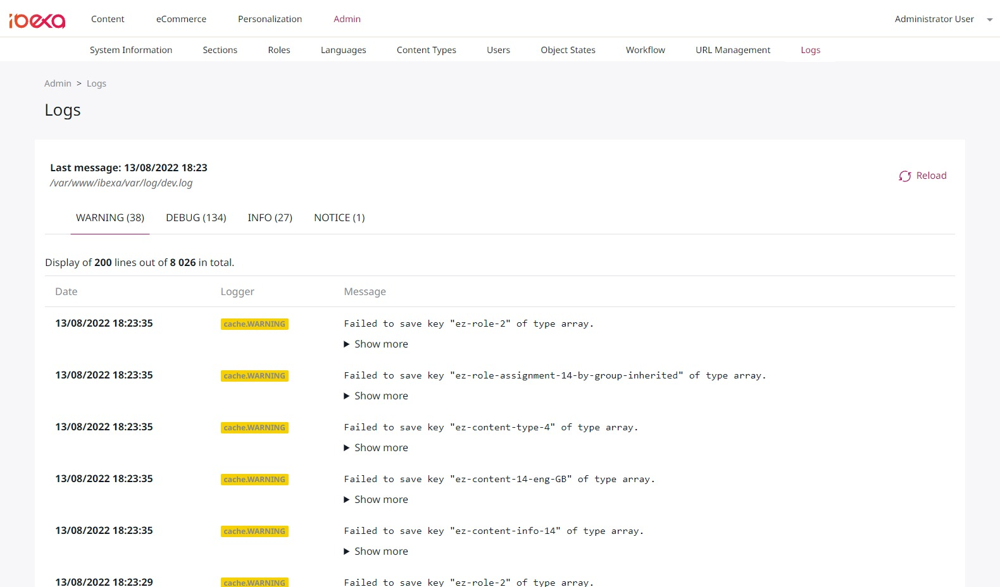

IbexaLogsUiBundle  
[](https://travis-ci.com/fkeloks/ibexa-logs-ui)
[](https://packagist.org/packages/fkeloks/ibexa-logs-ui)
============

Symfony bundle dedicated to Ibexa, to add a log management interface to the back office.



**Details**:

* Author: Florian Bouché
* Licence: [MIT]([https://opensource.org/licenses/MIT](https://opensource.org/licenses/MIT))

**Available translations**:

* en (English)
* fr (French)

## Requirements

* php: >=7.3
* ibexa: 3.3.*

:warning: Warning, in its current version, the bundle **only supports** log files in `Monolog/LineFormatter` format.  
[LineFormatter from Github](https://github.com/Seldaek/monolog/blob/master/src/Monolog/Formatter/LineFormatter.php)

## Installation

### Step 1: Download the Bundle

Open a command console, enter your project directory and execute the
following command to download the latest stable version of this bundle:

```console
$ composer require fkeloks/ibexa-logs-ui
```

This command requires you to have Composer installed globally, as explained in
the [installation chapter](https://getcomposer.org/doc/00-intro.md) of the Composer documentation.

### Step 2: Enable the Bundle

Add `IbexaLogsUi\Bundle\IbexaLogsUiBundle::class => ['dev' => true]`, in the `config/bundles.php` file, just before
the `EzPlatformAdminUiBundle` line.

Like this:

```php
<?php

return [
    // ...
    IbexaLogsUi\Bundle\IbexaLogsUiBundle::class => ['dev' => true],
    EzSystems\EzPlatformAdminUiBundle\EzPlatformAdminUiBundle::class => ['all' => true],
    // ...
];
```

If desired, the bundle can be activated in prod mode by replacing `dev` with `prod`.

### Step 3: Import bundle routing file

```yaml
# app/config/routing.yml or config/routing.yaml

_ibexa_logs_ui:
    resource: "@IbexaLogsUiBundle/Resources/config/routing.yml"
```

## License

This package is licensed under the [MIT license](LICENSE).
